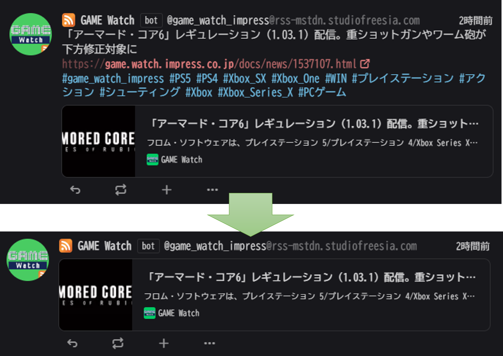

# Misskey Plugins

自分用 Misskey 向けプラグイン集

## Install 方法

1. `設定->プラグイン->プラグインのインストール`
2. 各プラグインのテキストコード(AiScript)を貼り付け
3. インストール！
   以上！

## Smart Feed Note

AiScript: [SmartFeedNote.is](src/SmartFeedNote.is)

企業アカウントがほぼいない現状、情報収集ツールとしては Feed Bot が非常に有用  
けどタイムラインが煩雑になるので簡易表示したい、というあなたに！

Feed Bot からの投稿をサムネイルのみ表示するように加工します。  
オプション設定で URL の表示、見出し文章の表示の切り替えもできます。

## Sensitive Note Minimize

AiScript: [SensitiveNoteMinimize.is](src/SensitiveNoteMinimize.is)

ローカルタイムラインとかでみんなが何を話してるか見たいがセンシティブ画像がいっぱい！  
今は文字情報を追いたいんだ！！ という人向け。

Misskey の設定だとボカシで画像を隠されててもノートのサイズはそのままなのでタイムラインを圧迫します。  
このプラグインは添付画像に一つでもセンシティブマークがされていたらノートを畳みます。  
※畳むというのは[もっと見る(80 文字 / 1 ファイル)]みたいな ContentWarning モードのやつです。

## Note Object Checker

AiScript: [NoteObjectsChecker.is](src/NoteObjectsChecker.is)

開発者用。というか完全に自分用。  
NoteObject に何が入ってるのか確認したい時に使う。

## 参考

[Misskey プラグインを作ってみよう @taichan\_](https://qiita.com/taichan_/items/0a092bb59b42aeb1f47d)  
[AiScript で困ったときに見るメモ @saki-lere](https://qiita.com/saki-lere/items/851c4500d56659d15c9c)

## その他

スクリプトの利用は自己責任で！
参考にしたり改造したりはご自由に！
何かあれば バイザン`@into_vision@misskey.io` までどうぞ！
